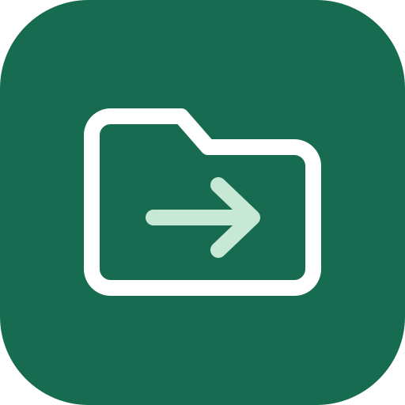
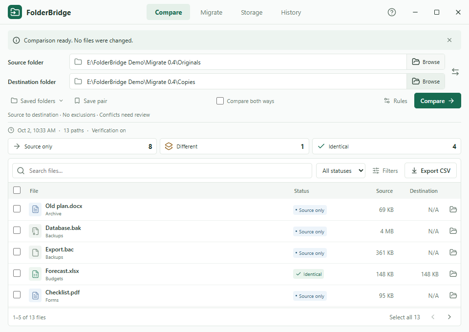
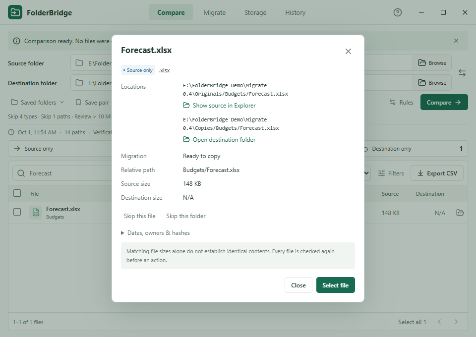
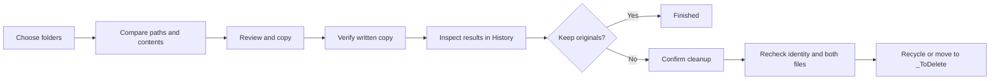
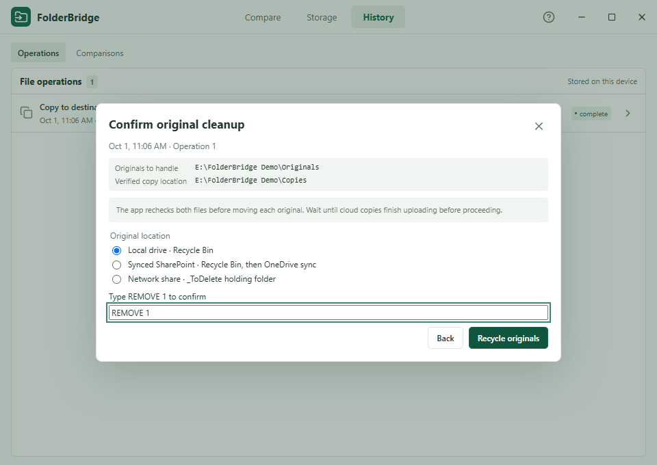
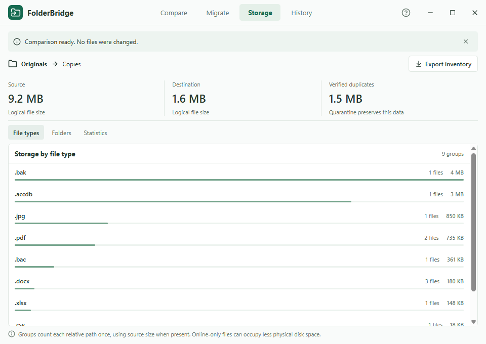
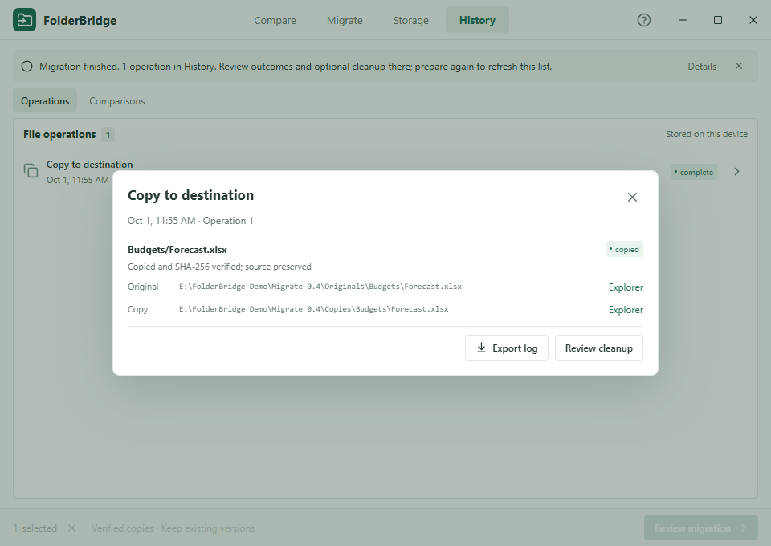

<p align="center">
  
</p>

# FolderBridge

**Compare folders, verify copies, and review cleanup in one small Windows app.**

FolderBridge shows what is missing, different, or identical between two folders. Copy the files you need, check the results, and remove originals only when you choose to. Every folder is selected by you, so the same app works with local folders, mapped drives, accessible network shares, and OneDrive-synced SharePoint libraries.

Built with **Tauri 2, Rust, React, TypeScript, and SQLite**. No FolderBridge account or Python installation is required.

[Download for Windows](https://github.com/socDocarol/FolderBridge/releases/latest) · [Quick start](#quick-start) · [Cleanup and recovery](#cleanup-and-recovery) · [Build from source](#build-from-source) · [Report an issue](https://github.com/socDocarol/FolderBridge/issues)



*Screenshots show the Windows app with synthetic files. They contain no private documents or real network or SharePoint data.*

## What it does

| Need | FolderBridge feature |
| --- | --- |
| Find files missing from a migration | Compare the same relative paths in a source and destination folder. |
| Check whether matching files are really equal | Use SHA-256 content verification, enabled by default. Equal size alone is never labeled identical. |
| Copy only what is missing | Copy source-only files to the destination, or recover destination-only files to the source. |
| Preserve conflicting versions | Keep both by giving the copied source version a new name. Existing files are not overwritten. |
| Finish a migration | Review successful copies, inspect both paths, and separately confirm cleanup of their originals. |
| Review duplicate copies | Move verified destination duplicates into a reversible quarantine. |
| Understand storage | See totals by file type and folder, plus average, median, and quartile file sizes. |
| Keep a record | Export inventories, statistics, and operation logs to CSV; revisit comparisons and outcomes in History. |

Use it for a folder handoff, a network-drive migration, a comparison with a synced document library, or a check before removing duplicate copies. It is an on-demand review tool; it does not continuously synchronize folders.

## Download and run

Open the [latest release](https://github.com/socDocarol/FolderBridge/releases/latest) and choose:

| File | Use it when |
| --- | --- |
| `FolderBridge_0.3.0.exe` | You want to run the app directly without installing FolderBridge. |
| `FolderBridge_0.3.0_x64-setup.exe` | You want a per-user installation. Setup can download WebView2 if it is missing. |
| `SHA256SUMS.txt` | You want to check that a download matches the published build. |

**Requirements:** Windows x64, Microsoft Edge WebView2, and permission to read the selected folders. Copying and cleanup also require the relevant write or move permissions. The app uses your Windows access; it does not mount drives or sign in to SharePoint.

The current build is unsigned, so Windows may show an unknown-publisher warning. Use the release attached to this repository and follow your organization's software policy. You do not need both the EXE and setup file.

To check a download in PowerShell:

```powershell
Get-FileHash .\FolderBridge_0.3.0.exe -Algorithm SHA256
```

Compare the hash with `SHA256SUMS.txt` from the same release. The standalone app still stores its history in your Windows profile; moving the EXE does not move that history.

## Quick start

1. **Choose folders.** Browse to a source and destination, or paste their paths. Leave the destination empty to inventory one folder.
2. **Compare.** Keep **Verify contents** enabled for content matching. The comparison reads files without changing them.
3. **Review the results.** Search or filter by status, file type, or minimum size. Click a filename for details; use Explorer buttons to inspect either location.
4. **Choose an action.** Select files, choose the action, and select **Review**. Check the folders and eligible count before confirming.
5. **Check the outcome.** Open the operation in **History**. If you want to remove copied originals, use **Review cleanup** there. Compare again to refresh the results after changes.

Selections can cover individual rows, the current page, or all matching results, up to **10,000 files per operation**. Use filters to break larger jobs into smaller batches.

Example folder choices:

```text
Local:       C:\Documents\Originals
Mapped:      Z:\Shared documents
Network:     \\server\share\Documents
SharePoint:  the library's synced folder in File Explorer
```

Choose separate roots. One selected folder cannot be inside the other.

### What each result means

Files are matched by their **relative path**, not just their filename or contents. For example, `Reports\Summary.pdf` in the source is compared with `Reports\Summary.pdf` in the destination. Identical files stored under unrelated paths are not grouped together.

| Result | Meaning |
| --- | --- |
| **Source only** | The relative path exists only in the source. |
| **Destination only** | The relative path exists only in the destination. |
| **Identical** | Both files have matching verified SHA-256 contents. |
| **Different** | The sizes differ, or content verification found different bytes. |
| **Not verified** | Both paths exist with the same size, but content verification was disabled. |
| **Excluded** | A selected file-type exclusion applies; the row stays visible without an action. |
| **Issue** | A path could not be read or checked. Inspect the reason before proceeding. |
| **Inventoried** | The file was found in a single-folder scan with no destination selected. |

Turning verification off makes the initial comparison faster because it avoids content hashing. Matching sizes remain **Not verified**, and cannot authorize duplicate quarantine. Copy operations still verify the bytes they write.

### Choose the right action

| Action | Eligible result | Effect |
| --- | --- | --- |
| **Copy to destination** | Source only | Copy the source file into the same relative destination path. |
| **Recover to source** | Destination only | Copy the destination file into the same relative source path. |
| **Keep both** | Different | Copy the source version beside the destination version with a new name. |
| **Quarantine duplicates** | Identical, content verified | Recheck both files and move the destination duplicate into quarantine. |
| **Review cleanup** in History | Successful copy with a valid identity record | Recheck the copied file and original, then perform the separately confirmed original cleanup. |

**Keep both** uses a name such as `Report (source copy 12).pdf`, where `12` is the operation ID. It does not choose which version is correct.

## Inspect files without searching for them



Result rows have an Explorer shortcut. File details provide separate source and destination buttons. Copy history adds the original, copied, and recovery locations.

An existing file is selected in Explorer; FolderBridge does not open its contents. When the file is missing, Explorer opens the nearest existing parent inside the selected root. Unavailable drives or inaccessible paths show an error.

## How it works



**Comparison:** the Rust engine inventories folders into a local SQLite database. Different-sized files are classified without hashing. When sizes match and verification is enabled, the engine reads both files and compares SHA-256 hashes. The interface displays paginated results while work runs outside the UI thread.

**Copying:** the engine opens the original, checks its recorded size and modification time, and streams its contents into a temporary file inside the target root. It calculates a hash while reading the source, flushes and rereads the staged copy, and compares the hashes. A verified copy is finalized without replacing an existing file. The original stays in place.

**Original cleanup:** copying also records the original's filesystem identity when that can be established safely. After you confirm cleanup, the engine checks that it is still the same original and rereads both files against the recorded copy hash. Only a matching pair can proceed. A new file with identical bytes at the original path does not qualify as the same original.

Copies preserve the main file contents and modification time. They do **not** clone ownership, permissions, alternate data streams, all filesystem metadata, or SharePoint metadata. A file may copy successfully while remaining ineligible for original cleanup.

## Cleanup and recovery

Copying and removing originals are separate actions. You can inspect the copied files first, keep originals indefinitely, or return to History later.



From a copy in **History**, choose **Review cleanup**, select eligible originals, and continue. Choose the original location type and type the displayed confirmation, such as `REMOVE 3`. The app checks the files again after confirmation; opening the review does not remove anything.

| Original location | What confirmed cleanup does | How to recover |
| --- | --- | --- |
| **Local drive** | Sends the original to Windows Recycle Bin. | Restore it in Windows, then complete **Review restore** in FolderBridge. |
| **Synced SharePoint** | Recycles the local original; OneDrive must synchronize the change to SharePoint. | Check the local and SharePoint recycle bins and the restored paths after sync. |
| **Network or mapped drive** | Moves the original into `_ToDelete\<operation ID>\<relative path>` inside the original root. | Use **Review restore** in History, or inspect the holding path in Explorer. |

Network drives are detected and must use `_ToDelete`. You may also choose `_ToDelete` for a local folder. Identify synced SharePoint explicitly; the app does not infer cloud state from a folder name.

### Windows Recycle Bin restoration has two steps

Before recycling, FolderBridge moves the verified original by its open file handle into:

```text
<original root>\.folderbridge-staging\cleanup-<operation ID>\<relative path>
```

This avoids recycling a replacement that appears at the original pathname. Windows therefore restores the item to that staging location.

1. Restore the file from **Windows Recycle Bin**.
2. Open its operation in **FolderBridge → History → Review restore** to return it to the original path.

History shows the exact recovery path. Restoration verifies the file and refuses to overwrite an occupied original path. Network `_ToDelete` restores do not need the Windows step.

### SharePoint uses your existing sync client

Choose a library already synced by OneDrive; do not paste a SharePoint website URL. Files On-Demand may download when read. FolderBridge does not request Microsoft credentials or call the SharePoint API.

**Wait until copied files finish uploading before cleaning up originals.** A locally verified copy does not prove that its upload finished. The app reports local cleanup; it cannot confirm cloud deletion, retention, versions, or permissions.

OneDrive may synchronize the temporary staging move before deletion, so a cloud recycle entry can show the recovery location. Manage cloud restoration through SharePoint and inspect the result after sync. See [Microsoft's guidance on synced files](https://support.microsoft.com/en-us/sharepoint/sync/work-with-synced-files-in-file-explorer).

### Duplicate quarantine is a separate option

**Quarantine duplicates** moves verified destination duplicates to:

```text
<destination root>\.folderbridge-quarantine\<operation ID>\<relative path>
```

The source stays in place. Restore these files from the quarantine operation in History. Quarantine and `_ToDelete` preserve data on the same drive; they do not reclaim disk space. The app has no permanent-delete action.

## Safety checks and practical limits

| Check | Behavior |
| --- | --- |
| Existing destination | Preserve it; skip the copy rather than overwrite it. |
| Original replaced or either copy changed | Refuse original cleanup and record the reason. |
| Extra data streams, encryption, or unverifiable identity | Original cleanup is unavailable; a main-stream copy may still succeed. |
| Open Access database | Adjacent `.ldb` or `.laccdb` lock files prevent cleanup. Close the database first. |
| Symlinks, junctions, escaping paths, or overlapping roots | Reject or report them; do not follow them as migration targets. |
| Incomplete scan | Block copy/quarantine actions until the issues are resolved and a new comparison completes. |
| Windows indicates permanent deletion | Refuse recycling. If recycling fails, try to return the unchanged staged original without overwriting. |
| Cancellation or interruption | Keep completed work. Retain pending recovery records for inspection; do not blindly repeat cleanup. |

Files remain locked against competing writes/deletes during content checks and exact-handle moves. Original cleanup also holds the verified target and parent directories while acting. These checks address ordinary file-operation races; they are not a security boundary against hostile software running as the same Windows user.

The preview checks eligibility without rereading every file's contents. Final cleanup does the full content check. Older copy records without original identity proof remain ineligible. Source directories are retained after cleanup.

FolderBridge is a migration utility, not a complete backup system. Current downloads target Windows x64. Live SMB servers, real OneDrive/SharePoint synchronization, macOS/Linux behavior, and large production inventories have not been validated. There is no background scheduler, automatic mirror mode, direct SharePoint login, or cloud metadata migration.

## Storage insights and reports



**Storage** shows source and destination totals, verified duplicate bytes, groups by file type or top-level folder, and size statistics: mean, median, lower quartile, and upper quartile. Distribution statistics count each relative path once, preferring source size when both sides exist. Source/destination totals count the sides separately. These are logical sizes, not guaranteed physical disk use.

Export three kinds of CSV:

| Report | Contains |
| --- | --- |
| Inventory/comparison | Relative path, status, extension, sizes, modification times, available hashes, owner IDs, and issues. Current filters apply. |
| Size statistics | File counts and size distributions by extension. |
| Operation log | Original/copy paths, outcome, hash, cleanup method/state, recovery path, and messages. |

Exports require a new filename and neutralize spreadsheet formula prefixes. Optional Windows owner collection records SIDs, not resolved account names; enabling it can slow network inventory.

## Local data and privacy



FolderBridge has no analytics or application account. It reads the folders you choose and stores comparisons, saved pairs, paths, hashes, and operation history in:

```text
%LOCALAPPDATA%\com.folderbridge.desktop\folderbridge.sqlite
```

The database is separate from the EXE and does not move automatically to another computer. Keep it with the recorded holding files when you need app-assisted restoration. Treat exported paths and logs as potentially sensitive before sharing them.

`_ToDelete`, `.folderbridge-quarantine`, and `.folderbridge-staging` are excluded from ordinary comparisons. Leftover staging files produce an issue that blocks new scan-based actions until inspected; recorded recovery remains available from History.

## Build from source

You need Node.js **20.19+ in the 20.x line, or 22.12+**, npm, Rust, Windows C++ build tools, and WebView2. Follow [Tauri's prerequisites](https://v2.tauri.app/start/prerequisites/) for the native toolchain. The current build was validated with Node 24 and Rust 1.97 on Windows x64.

```powershell
git clone https://github.com/socDocarol/FolderBridge.git
cd FolderBridge
npm ci
npm run desktop
```

For a browser-only preview with synthetic data:

```powershell
npm run dev
```

Open `http://127.0.0.1:1420`. This preview is labeled and cannot access real folders. Production builds exclude the demo transport and visual experiments.

For a Windows release:

```powershell
.\tools\build-release.ps1
```

The script builds the EXE and NSIS installer, remaps compiler paths to remove local profile names, and writes versioned assets plus `SHA256SUMS.txt` into `release/public-v<version>/`. It restores the process's build environment afterward. Inspect release assets before publishing; this is a path-remapping measure, not a signing service or a promise of byte-for-byte reproducible builds.

### Verify changes

```powershell
npm run build
npm test
npm run test:engine
npx playwright install chromium
npm run test:e2e
cargo clippy --manifest-path src-tauri/Cargo.toml --all-targets -- -D warnings
```

Version 0.3.0 validation includes **37 Rust tests, 3 frontend unit tests, and 8 browser checks**, plus native Windows scan/copy/cleanup/restore, Explorer navigation, CSV export, and a disposable-file Recycle Bin round trip. These checks do not establish live SharePoint or SMB behavior.

For isolated native smoke testing, launch a test build with separate app and WebView2 data directories, then run the included harness:

```powershell
$testProfile = Join-Path (Get-Location) ('qa\native-' + [guid]::NewGuid().ToString('N'))
$env:FOLDERBRIDGE_DATA_DIR = $testProfile
$env:WEBVIEW2_USER_DATA_FOLDER = Join-Path $testProfile 'webview'
$env:WEBVIEW2_ADDITIONAL_BROWSER_ARGUMENTS = '--remote-debugging-port=9227'
Start-Process '.\release\public-v0.3.0\FolderBridge_0.3.0.exe' -WindowStyle Hidden
node tests/native-smoke.mjs
```

Use a separate terminal for this test profile. The harness creates disposable fixtures and opens Explorer for them. Close its test windows and app afterward. Release builds do not enable remote debugging themselves.

### Project layout

```text
src/                         React interface and typed command boundary
src-tauri/src/engine/         Comparison, copy, cleanup, and report logic
src-tauri/src/cleanup_native.rs  Windows identity, stream checks, and recycling
src-tauri/src/paths.rs        Path containment and no-overwrite moves
src-tauri/src/storage.rs      SQLite inventory and operation journal
src-tauri/src/reveal.rs       Validated Explorer navigation
src-tauri/tests/              Disposable filesystem safety tests
tests/                       Browser and native smoke checks
docs/images/                 Public screenshots with synthetic data
tools/build-release.ps1       Windows release packaging
experiments/                 Development-only visual trials
```

The app runs its own Rust engine. It does not call legacy migration scripts or require their original folders.

## Questions and contributions

For a bug report, include the app version, Windows version, operation, folder type (local, mapped, UNC, or synced), expected result, and the displayed error. Replace private paths and names before attaching screenshots or logs. Use [GitHub Issues](https://github.com/socDocarol/FolderBridge/issues).

Small, focused changes are easiest to review. File-changing behavior should include disposable-file tests covering failure, interruption, and recovery. Keep public screenshots and test fixtures synthetic.

## License

No license has been selected for this repository yet.
